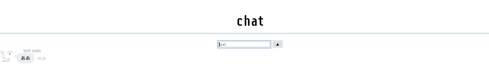

# node-chat

- simple chat using node.js(websocket)
- [demo](https://node-chat-tmasaaa.glitch.me/)

# Map
- NOW
- LINE-LIKE
- NEW

## TODO
JS
- [ ] Hyperlink
- [ ] HTML tag Escape
- [ ] UserID(DB?)
- [ ] save(DB?)
- [ ] join,left

HTML CSS
- [ ] template design

